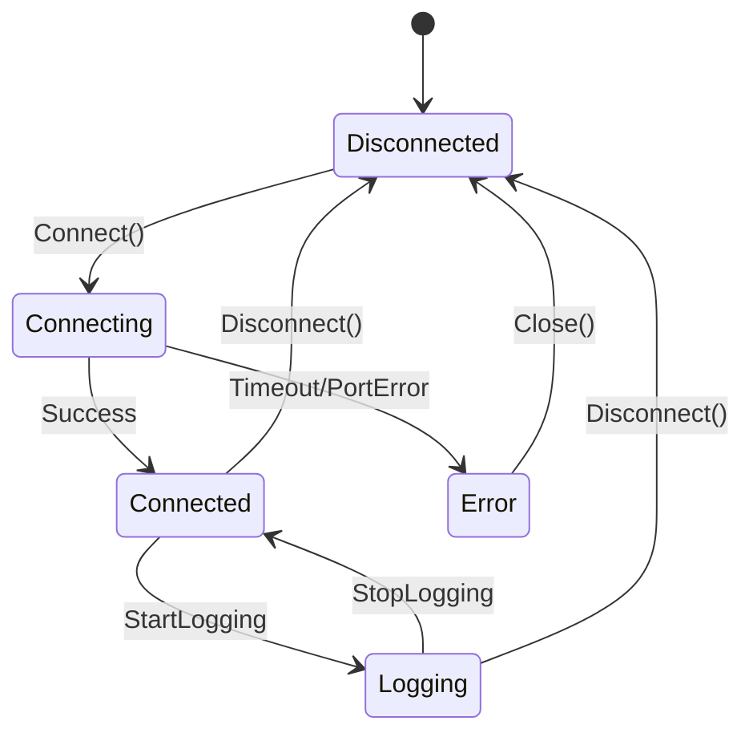
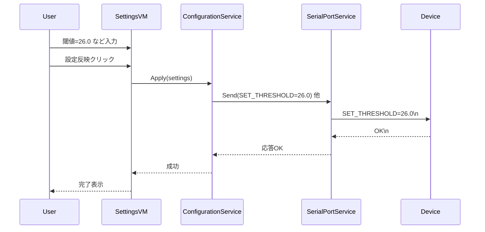
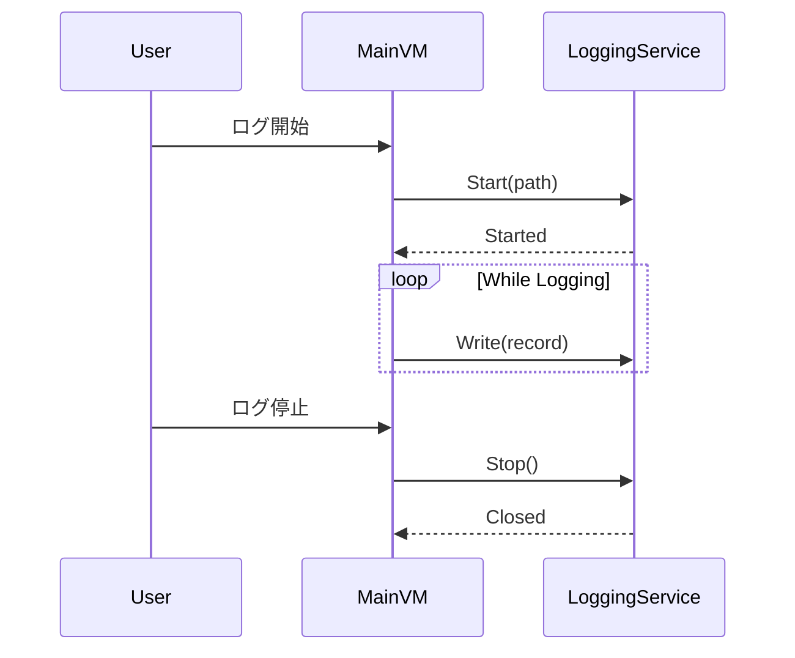

# DeviceLogManager ソフトウェア仕様書

## 1. 文書情報
- 文書名: DeviceLogManager ソフトウェア仕様書
- バージョン: 0.9 (初版ドラフト)
- 作成日: 2025-10-03
- 対象リリース: 初回リリース (R1)
- 作成者: （記入）
- 承認者: （記入）

## 2. 背景と目的
温度センサー機器とPCをシリアル通信で接続し、1秒ごとに取得した温度データをリアルタイム表示・CSVロギング・グラフ描画しつつ、機器設定値（測定間隔・閾値・単位）をGUIから操作可能とする Windows デスクトップアプリ (C# / WPF) を開発する。保守性と拡張性を高めるため MVVM アーキテクチャを採用する。

## 3. 用語定義
| 用語 | 説明 |
|------|------|
| 機器 | 温度センサー本体 (シリアル接続) |
| ポーリング | 一定間隔で機器へ取得コマンド送信し値を受信する処理 |
| 測定値 | 温度 (単位はCまたはF) |
| 閾値 | 警告判定の基準温度 |
| ステータス | 機器から取得する状態: OK / WARN / ERROR など（仮）|
| MVVM | Model-View-ViewModel パターン |

## 4. 想定利用シナリオ
1. ユーザーがアプリ起動 → 接続可能な COM ポートを選択 → 接続
2. 1秒単位で温度が一覧/グラフに更新される
3. 必要に応じてログ保存開始 → CSVに追記 → 停止でファイルクローズ
4. 設定タブで閾値/測定間隔/単位を変更 → 書き込み実行 → 反映
5. 閾値超過時に UI 上で警告表示

## 5. スコープ
### 5.1 本リリース対象
- シリアル通信(単一デバイス) / 1ポート接続
- 単一デバイスの温度計測・閾値警告
- CSVロギング・リアルタイム折れ線グラフ
- 設定 GUI からの書き込み (3項目)

### 5.2 非対象 (将来拡張候補)
- 複数ポート同時接続
- ネットワーク経由通信
- DB 保存 (SQLite 等)
- 複数種センサー混在
- アラートメール通知

## 6. システム構成概要
ローカル PC 上で完結する単一プロセス WPF アプリ。外部依存は OS のシリアルポートドライバのみ。

```
+--------------------------------------------------+
| WPF UI (Views)                                   |
|  +--------------------------------------------+  |
|  | ViewModels (Main, Logging, Settings, Chart)|  |
|  +--------------------------------------------+  |
|              |          |          |            |
|              v          v          v            |
|            Services (抽象インタフェース)         |
|  +----------------+ +----------------+          |
|  | SerialPortSvc  | | LoggingSvc     |          |
|  | DataAcquireSvc | | ChartDataSvc   |          |
|  | ConfigSvc      | | AlertSvc(拡張)|          |
|  +----------------+ +----------------+          |
|              |                                      |
|              v (COM)                                |
|          Device(温度センサー)                       |
+--------------------------------------------------+
```

## 7. アーキテクチャ / レイヤ
| レイヤ | 主責務 | 主なクラス例 |
|--------|--------|-------------|
| View | XAML 表示 | MainWindow.xaml, SettingsView.xaml |
| ViewModel | UI 状態・コマンド公開 | MainViewModel, SettingsViewModel, LoggingViewModel, ChartViewModel |
| Service | インフラ抽象, 機能提供 | ISerialPortService, IDataAcquisitionService, ILoggingService, IConfigurationService, IChartDataService |
| Model | ドメインデータ | TemperatureRecord, DeviceSettings, DeviceStatus |
| Infra | 具体実装 | SerialPortService, CsvLoggingService |

## 8. 機能仕様
### 8.1 機器接続・データ取得
| 項目 | 内容 |
|------|------|
| 入力 | COMポート名, ユーザー操作(接続/切断) |
| 出力 | 温度値(double), タイムスタンプ(DateTime), ステータス(string) |
| ポーリング間隔 | 基本: 1秒 (設定変更時は Machine Interval に追従) |
| 例外/異常 | タイムアウト, ポート占有, 形式不正応答 |
| エラーハンドリング | ViewModel 経由でメッセージ領域に表示 / ログ出力 |

### 8.2 データロギング
| 項目 | 内容 |
|------|------|
| フォーマット | CSV (UTF-8 / BOM 有無: BOM有推奨) |
| 列 | Timestamp, Temperature, Unit, Status, Threshold, Interval |
| ファイル命名 | DeviceLog_yyyyMMdd_HHmmss.csv |
| 保存先 | ユーザー指定フォルダ (設定ダイアログ) |
| ローテーション | ログ開始毎に新規ファイル |
| 並行性 | ログ書込みは専用非UIスレッド (Task) キューで逐次処理 |

### 8.3 データ可視化
| 項目 | 内容 |
|------|------|
| グラフ種別 | 折れ線 (時間 x 温度) |
| 表示範囲 | 直近 N 分 (デフォルト 10分) / 超過分は古い点を破棄 (可変) |
| ON/OFF | トグルボタンで描画停止時も内部データ保持可 (設定) |
| 更新方式 | ObservableCollection バインド / Dispatcher.Invoke 最小化 |

### 8.4 機器設定管理
| 設定項目 | 型 | 範囲 | コマンド例 |
|----------|----|------|------------|
| MEASURE_INTERVAL | int | 1..60 | SET_INTERVAL=5\n |
| WARN_THRESHOLD | double | -50..100 | SET_THRESHOLD=25.5\n |
| UNIT | enum | C / F | SET_UNIT=C\n |
| 読み出しコマンド | - | - | GET_CONFIG\n |

### 8.5 コマンド/プロトコル (テキスト例)
- 温度取得: `GET_TEMP\n`
  - 応答例: `TEMP:24.56;STATUS:OK;TH:25.00;INT:1;UNIT:C\n`
- 設定書込み (閾値): `SET_THRESHOLD=25.5\n` → 応答: `OK\n` or `ERR:OUT_OF_RANGE\n`
- 設定取得: `GET_CONFIG\n` → `INT:1;TH:25.0;UNIT:C\n`

### 8.6 応答パース仕様
| キー | 説明 | 型 |
|------|------|----|
| TEMP | 温度 | double |
| STATUS | 機器状態 | string (OK/WARN/ERROR) |
| TH | 閾値 | double |
| INT | 測定間隔 | int |
| UNIT | 単位 | char (C/F) |

不正フォーマット時: エラーイベント発火 → リトライ最大3回 → 失敗時接続維持しつつ対象測定値を無視しログにエラー行追加 (Temperature=blank, Status=PARSE_ERROR)。

### 8.7 状態遷移


## 9. 画面仕様 (概要ワイヤ)
```
+--------------------------------------------------------------------------------+
| メインウィンドウ                                                               |
| Port: [COM3 ▼] [接続] [切断]   ステータス: Connected / ErrorMsg                |
|--------------------------------------------------------------------------------|
| 温度: 24.56 °C   閾値: 25.00 °C  判定: (OK/WARN)                               |
| [グラフ表示 ON/OFF]  [ログ開始] [ログ停止]  保存先: C:\Logs\ ...              |
|--------------------------------------------------------------------------------|
| (折れ線グラフエリア - 直近10分)                                               |
|--------------------------------------------------------------------------------|
| 設定: 間隔[s] [ 1 ]  閾値[°C] [25.0 ]  単位 [C▼]  [設定反映]                   |
| ログ: ファイル名: DeviceLog_20251003_101500.csv                                |
+--------------------------------------------------------------------------------+
```

## 10. クラス設計 (概略 UML)
```mermaid
classDiagram
    class MainViewModel {
        +PortNames: ObservableCollection<string>
        +SelectedPort: string
        +CurrentRecord: TemperatureRecord
        +IsConnected: bool
        +IsLogging: bool
        +ConnectCommand()
        +DisconnectCommand()
        +StartLoggingCommand()
        +StopLoggingCommand()
    }
    class SettingsViewModel {
        +MeasureInterval:int
        +WarnThreshold:double
        +Unit:TemperatureUnit
        +ApplySettingsCommand()
    }
    class TemperatureRecord {
        +Timestamp:DateTime
        +Value:double
        +Unit:TemperatureUnit
        +Status:string
        +Threshold:double
        +Interval:int
    }
    enum TemperatureUnit { C; F }

    interface ISerialPortService {
        +Open(port:string)
        +Close()
        +Send(command:string)
        +DataReceived: event
        +IsOpen: bool
    }
    interface IDataAcquisitionService {
        +Start(intervalMs:int)
        +Stop()
        +RecordReceived: event(TemperatureRecord)
    }
    interface ILoggingService {
        +Start(path:string)
        +Write(record:TemperatureRecord)
        +Stop()
    }
    interface IConfigurationService {
        +Apply(settings:DeviceSettings)
        +Read():DeviceSettings
    }
    class DeviceSettings { +Interval:int +Threshold:double +Unit:TemperatureUnit }

    MainViewModel --> IDataAcquisitionService
    MainViewModel --> ILoggingService
    MainViewModel --> ISerialPortService
    SettingsViewModel --> IConfigurationService
    IDataAcquisitionService --> ISerialPortService
    IConfigurationService --> ISerialPortService
```

## 11. シーケンス図
### 11.1 ポーリング取得フロー
```mermaid
sequenceDiagram
    participant User
    participant MainVM as MainViewModel
    participant Poller as DataAcquisitionService
    participant Serial as SerialPortService
    participant Dev as Device

    User->>MainVM: 接続要求
    MainVM->>Serial: Open(port)
    Serial-->>MainVM: Open結果(成功)
    MainVM->>Poller: Start(interval=1000ms)
    loop 毎秒
        Poller->>Serial: Send("GET_TEMP")
        Serial->>Dev: GET_TEMP\n
        Dev-->>Serial: TEMP:24.56;STATUS:OK;...
        Serial-->>Poller: 受信文字列
        Poller->>Poller: パース→TemperatureRecord
        Poller-->>MainVM: RecordReceived(record)
        MainVM->>LoggingSvc: (IsLogging? Write(record))
        MainVM->>Chart: グラフデータ追加
    end
```

### 11.2 設定変更フロー


### 11.3 ログ開始/停止


## 12. 非機能要件詳細
| 項目 | 指標/内容 |
|------|-----------|
| パフォーマンス | 1秒間隔取得で UI フリーズ無し (UI スレッド処理 < 50ms/周期) |
| 信頼性 | 通信失敗時 3回再試行 / 連続失敗でエラー表示継続・自動再接続オプション(将来) |
| 保守性 | SOLID, DI(依存性注入) 利用 (Simple Injector / .NET DI) |
| 拡張性 | 別センサー追加時は IDataAcquisitionService 実装切替のみ |
| ロギング | アプリ内部診断ログ (NLog など) 出力 (拡張) |
| セキュリティ | シリアルのみで認証不要 / 外部公開無し |
| 国際化 | 第1版: 日本語 UI のみ |

## 13. エラーハンドリング・メッセージ
| エラーコード | 発生条件 | 対応表示例 |
|--------------|----------|------------|
| PORT_OPEN_FAIL | ポートオープン失敗 | "ポートを開けません: COM3" |
| READ_TIMEOUT | 応答遅延 | "応答なし (タイムアウト)" |
| PARSE_ERROR | フォーマット不正 | "受信データ形式不正" |
| INVALID_RANGE | 設定値範囲外 | "設定値が許容範囲外です" |

## 14. CSV 仕様
例:
```
Timestamp,Temperature,Unit,Status,Threshold,Interval
2025-10-03T10:15:30.123,24.56,C,OK,25.00,1
2025-10-03T10:15:31.124,24.60,C,OK,25.00,1
```
- 小数点: '.' (InvariantCulture)
- 時刻: ISO8601 ローカル or UTC (決定: ローカル+オフセット検討) → R1: ローカル

## 15. 設定ファイル (アプリ設定例 appsettings.json)
```json
{
  "Logging": {
    "Enable": true,
    "DefaultDirectory": "C:/Logs/Device"
  },
  "Chart": {
    "HistoryMinutes": 10,
    "MaxPoints": 600
  }
}
```

## 16. コンカレンシ / スレッドモデル
| 領域 | 手段 | 注意点 |
|------|------|--------|
| ポーリング | System.Threading.Timer or Task.Delay ループ | UI 更新は Dispatcher へ切替 |
| シリアル受信 | SerialPort.DataReceived (別スレッド) | バッファ→キュー→パーサ |
| CSV書込み | BlockingCollection キュー消費 Task | バックプレッシャ制御 (最大キュー長) |

## 17. バリデーション仕様
| 項目 | 条件 | NG処理 |
|------|------|--------|
| 間隔 | 1<=x<=60 | 入力コントロール赤枠/ボタン無効 |
| 閾値 | -50<=x<=100 | 同上 |
| 単位 | C/F | デフォルト=C |

## 18. テスト観点 (抜粋)
| 番号 | 観点 | ケース例 |
|------|------|----------|
| T01 | ポート接続 | 存在/非存在/占有中 |
| T02 | ポーリング | 1秒周期で連続N回 (N=100) 取得遅延許容範囲内 |
| T03 | パース | 正常/キー欠損/数値不正 |
| T04 | 閾値警告 | 下回る→OK, 上回る→WARN表示 |
| T05 | 設定反映 | 範囲内/範囲外 ERR 応答 |
| T06 | ログ | 開始→追記→停止→ファイル整合性 |
| T07 | グラフ | 600点超過で古い点破棄 |
| T08 | 多重操作 | ログ開始中に再度開始禁止 |

## 19. リスクと対応
| リスク | 内容 | 低減策 |
|--------|------|--------|
| パフォーマンス劣化 | UIスレッド過負荷 | バッチ更新/データ点削減 |
| フォーマット変更 | デバイスFW更新 | 設定ファイルでパーサ差替え設計 |
| 予期せぬ例外 | SerialPort内部 | グローバル例外ハンドラ + ログ |

## 20. ログレベル (拡張案)
| レベル | 例 |
|--------|----|
| INFO | 接続成功, 設定適用 |
| WARN | 一時タイムアウト |
| ERROR | ポート切断, パース失敗連続 |

## 21. 移植性/拡張方針
- 他OS対応: SerialPort 抽象化により .NET MAUI への移行検討余地
- 保存先 DB 化: ILoggingService 実装追加

## 22. 開発標準
| 項目 | 内容 |
|------|------|
| コーディング規約 | .NET 標準 (PascalCase / async suffix) |
| 静的解析 | Roslyn Analyzers / StyleCop (任意) |
| 単体テスト | xUnit (サービス層中心) |
| 依存注入 | Microsoft.Extensions.DependencyInjection |

## 23. 成功基準 (受入条件)
| # | 条件 |
|---|------|
| A1 | 5分連続取得で欠損 0% |
| A2 | ログファイルフォーマット仕様整合 |
| A3 | 設定反映後 次周期で値反映確認 |
| A4 | 閾値超過時 1秒以内に警告表示 |
| A5 | バリデーションで不正入力を防止 |

## 24. 今後の課題 (Backlog)
- ダークテーマ UI
- 複数センサータブ
- WARN時音声通知
- CSV → SQLite オプション
- オート再接続

## 付録 A: 例外分類
| 分類 | 例 | 処理 |
|------|----|------|
| 通信 | TimeoutException | リトライ / WARN |
| I/O | IOException | エラー表示 / 停止 |
| パース | FormatException | レコードスキップ |

## 付録 B: 疑似コード (ポーリング)
```
while(!cts.IsCancellationRequested){
  var raw = serial.SendAndReceive("GET_TEMP\n", timeoutMs:500);
  var record = parser.Parse(raw);
  uiDispatcher.Post(() => mainVm.Update(record));
  if(logging) logQueue.Add(record);
  await Task.Delay(intervalMs - elapsed);
}
```

---
(以上)
