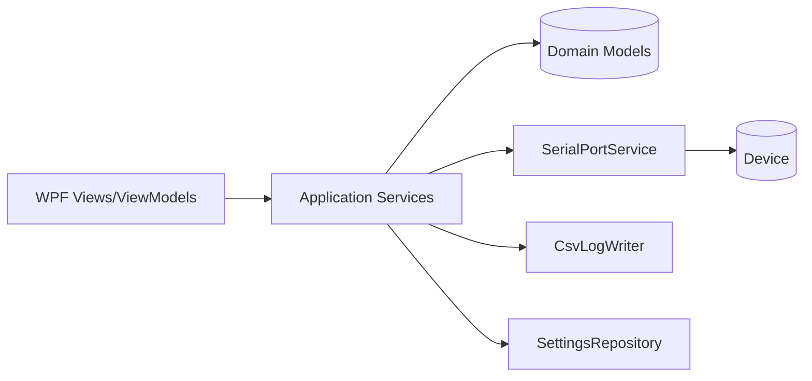
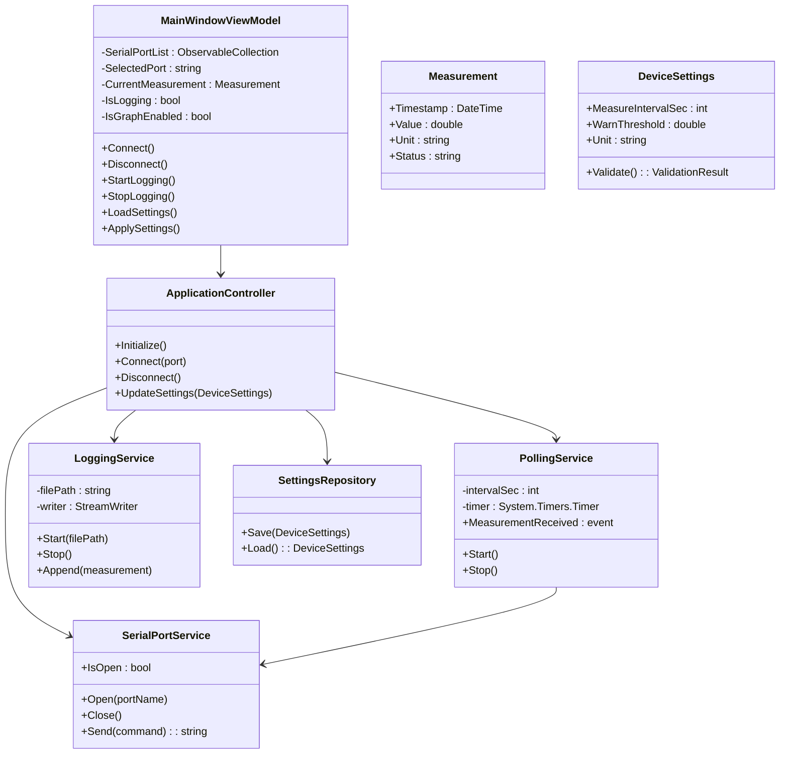
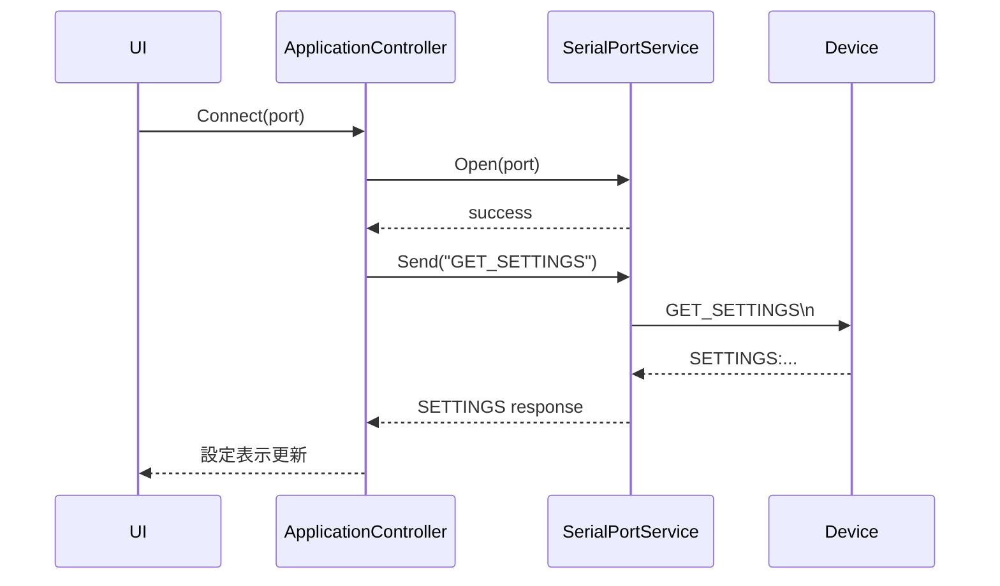
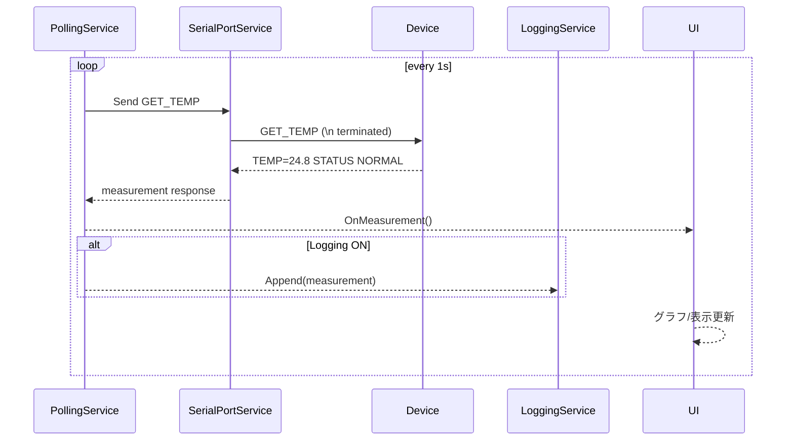
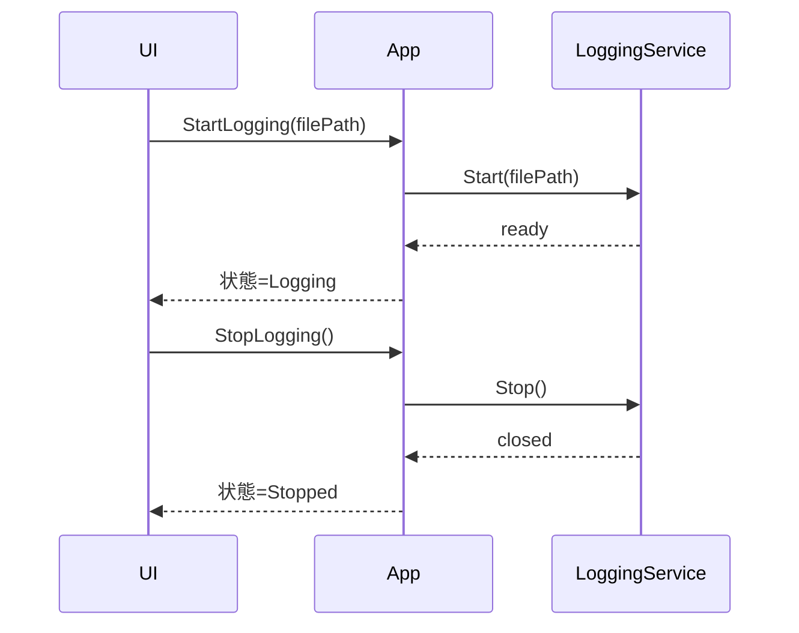
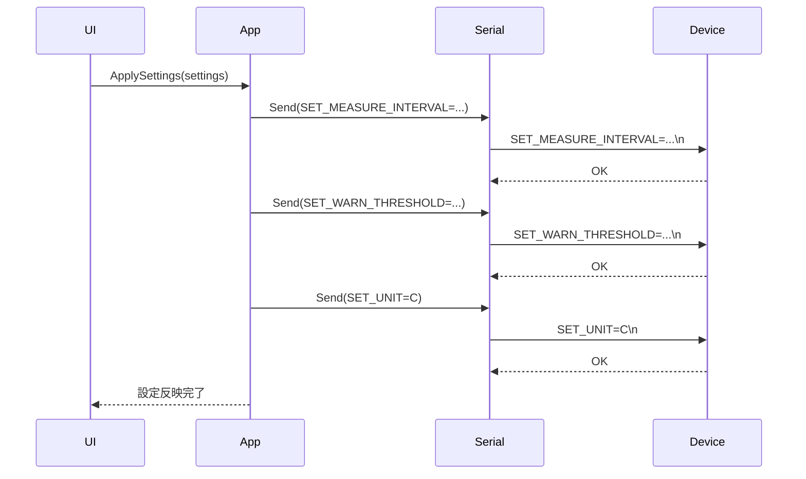
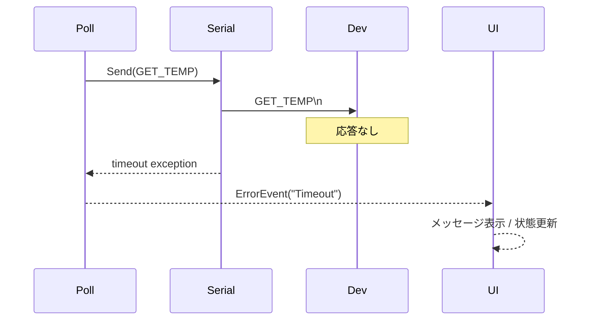
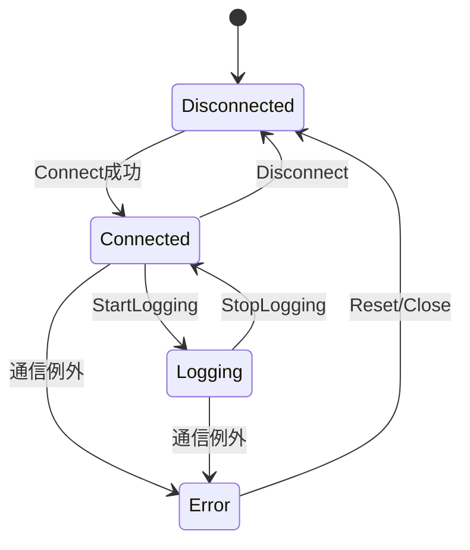

# DeviceLogManager ソフトウェア仕様書

## 1. 文書情報
- 文書名: DeviceLogManager ソフトウェア仕様書
- 版数: 1.0 (初版 / デモ用)
- 作成日: 2025-10-03
- 作成者: （記入）
- 承認者: （記入）

## 2. 概要
温度センサー機器とシリアルポート (COM) 経由で通信し、1秒周期で温度や機器ステータスを取得して表示・保存・可視化し、さらに機器設定 (測定間隔 / 警告閾値 / 単位) を GUI から変更できる Windows デスクトップ (WPF / C#) アプリケーションである。

## 3. 用語定義
| 用語 | 説明 |
|------|------|
| デバイス / 機器 | 温度センサーを内蔵し、テキストコマンドを受信/応答する外部機器 |
| ポーリング | 周期的 (既定1秒) に GET_TEMP コマンドを送出し温度を取得する処理 |
| ロギング | 取得データを CSV に逐次追記保存する動作 |
| UI | WPF フロントエンド画面 |
| 設定 | 機器内部の稼働パラメータ (MEASURE_INTERVAL / WARN_THRESHOLD / UNIT) |

## 4. システム範囲
```
┌──────────┐     シリアル (COM)     ┌─────────────┐
│ Windows PC │ <====================> │ 温度センサー機器 │
└──────────┘                        └─────────────┘
    │ WPFアプリ
    │  - 表示 / 設定変更 / 保存 / 可視化
```

## 5. ユースケース一覧
| ID | 名称 | アクター | 説明 |
|----|------|----------|------|
| UC-01 | 機器へ接続 | オペレータ | 利用可能な COM ポートから機器へ接続する |
| UC-02 | 温度リアルタイム表示 | オペレータ | 1秒ごとに取得した温度を画面に表示 |
| UC-03 | ログ取得開始/停止 | オペレータ | 取得データの CSV 保存を開始/停止 |
| UC-04 | リアルタイムグラフ表示切替 | オペレータ | 折れ線グラフの ON/OFF 切替 |
| UC-05 | 設定値読込 | オペレータ | 機器から現在設定を読み出し表示 |
| UC-06 | 設定値変更 | オペレータ | GUI で入力し機器へ反映 |
| UC-07 | 閾値警告表示 | システム | WARN_THRESHOLD 超過時に UI で警告表示 |
| UC-08 | 通信エラー通知 | システム | タイムアウトやポート断などをユーザへ通知 |

## 6. ユースケース詳細 (例: UC-03 ログ取得開始/停止)
| 項目 | 内容 |
|------|------|
| 目的 | 温度データを持続的に蓄積し後分析可能にする |
| トリガ | ユーザが「ログ開始」ボタン押下 |
| 事前条件 | 機器接続済み、ポーリング稼働中 |
| 基本フロー | (1) ボタン押下 → (2) ログマネージャ開始 → (3) 次回ポーリング結果からCSV追記 → (4) 状態表示更新 |
| 代替/例外 | CSV書込失敗 → エラー通知し自動停止 |
| 事後条件 | CSVにヘッダ行 + データが追記 |
| 成功保証 | ログ状態=Running、ファイルサイズ増加 |

## 7. 画面仕様 (メインウィンドウ)
### 7.1 レイアウト概要 (簡易ワイヤ)
```
┌───────────────────────────────────────────┐
│ [ポート選択: ▼COM3] [接続] [切断]  状態: Connected / Disconnected│
├───────────────────────────────────────────┤
│ 現在温度: 24.8 °C    閾値: 30.0 °C  ステータス: NORMAL        │
│ [グラフ表示 ON/OFF]                                          │
│ ┌───────────────────────────────┐          │
│ │      リアルタイム折れ線グラフ │          │
│ └───────────────────────────────┘          │
├───────────────────────────────────────────┤
│ ログ: [開始] [停止]  保存先: C:\logs\... [参照]                │
├───────────────────────────────────────────┤
│ 設定  測定間隔(s): [ 1 ]  閾値(°C/F): [ 30.0 ] 単位: (○C ○F)   │
│ [設定読み込み] [設定適用]                                       │
├───────────────────────────────────────────┤
│ メッセージ/エラーパネル                                           │
└───────────────────────────────────────────┘
```

### 7.2 UI 要素一覧
| ID | 要素 | 種別 | 機能 | バリデーション |
|----|------|------|------|----------------|
| UI-01 | ポート選択 | ComboBox | 利用可能COM列挙 | 存在ポートのみ |
| UI-02 | 接続ボタン | Button | ポート開く | ポート未選択→不可 |
| UI-03 | 切断ボタン | Button | ポート閉じる | 未接続→不可 |
| UI-04 | 現在温度表示 | TextBlock | 最新温度表示 | - |
| UI-05 | グラフ表示切替 | ToggleButton | グラフ描画ON/OFF | - |
| UI-06 | ログ開始 | Button | ログ開始 | 既に開始中→不可 |
| UI-07 | ログ停止 | Button | ログ停止 | 停止中→不可 |
| UI-08 | 保存先選択 | Button | フォルダダイアログ | 書込権限必須 |
| UI-09 | 測定間隔 | TextBox | 設定入力 | 1〜60 整数 |
| UI-10 | 閾値 | TextBox | 設定入力 | -50〜100 数値 |
| UI-11 | 単位 | RadioButton | C / F 切替 | いずれか必須 |
| UI-12 | 設定読み込み | Button | GET 設定 | - |
| UI-13 | 設定適用 | Button | SET コマンド送信 | 入力検証OK必須 |
| UI-14 | メッセージパネル | ListBox | 情報/警告/エラー表示 | - |

## 8. アーキテクチャ
### 8.1 レイヤ構成
| レイヤ | 役割 |
|--------|------|
| Presentation (WPF) | UI、バインディング、ユーザインタラクション |
| Application Service | ユースケースオーケストレーション (接続、開始/停止、設定適用) |
| Domain | エンティティ (Measurement, DeviceSettings, LoggerState) + ドメインロジック |
| Infrastructure | シリアル通信、CSV 書込、時刻取得、設定永続化 |

### 8.2 コンポーネント図 (概念)


## 9. データモデル
### 9.1 取得データ (Measurement)
| フィールド | 型 | 説明 |
|------------|----|------|
| Timestamp | DateTime | 取得時刻 (ローカル, ISO8601保存) |
| Value | double | 温度値 |
| Unit | string | "C" or "F" |
| Status | string | NORMAL / WARN / ERROR |

### 9.2 設定 (DeviceSettings)
| フィールド | 型 | 範囲 | デフォルト |
|------------|----|------|------------|
| MeasureIntervalSec | int | 1–60 | 1 |
| WarnThreshold | double | -50–100 | 30.0 |
| Unit | string | C/F | C |

### 9.3 CSV ログフォーマット
1行目ヘッダ: `Timestamp,Value,Unit,Status`
例: `2025-10-03T10:15:01.123,24.8,C,NORMAL`

## 10. 通信プロトコル仕様 (テキスト + 改行 `\n`)
| コマンド送信 | 説明 | 応答例 |
|--------------|------|--------|
| GET_TEMP | 温度要求 | TEMP=24.8;STATUS=NORMAL |
| GET_SETTINGS | 設定読込 | SETTINGS:MEASURE_INTERVAL=1;WARN_THRESHOLD=30.0;UNIT=C |
| SET_MEASURE_INTERVAL=秒 | 測定間隔設定 | OK |
| SET_WARN_THRESHOLD=値 | 閾値設定 | OK |
| SET_UNIT=C|F | 単位設定 | OK |
| SET_THRESHOLD=値 | (旧)互換コマンド | OK / ERR:DEPRECATED |
| PING | 疎通確認 | PONG |

エラー応答共通形式: `ERR:CODE` 例: `ERR:INVALID_VALUE`

## 11. クラス設計 (概略)


## 12. シーケンス図
### 12.1 接続 & 初期化


### 12.2 ポーリング (1秒周期)


### 12.3 ログ開始/停止


### 12.4 設定変更


### 12.5 エラー (タイムアウト)


## 13. 状態遷移 (ロギング + 接続)


## 14. 非機能要件具体化
| 区分 | 指標 | 基準 |
|------|------|------|
| パフォーマンス | 温度取得処理遅延 | 取得コマンド発行〜UI反映 < 300ms (通常) |
| パフォーマンス | グラフ描画 | 1秒周期でフリーズなし (UI スレッドブロック < 50ms) |
| 保守性 | クラスSRP | 1クラス1責務 (通信/ロギング/設定分離) |
| 可観測性 | ログ | 主要イベント (Connect/Disconnect/Error/Start/Stop/SettingChange) をINFO以上で出力 |
| 信頼性 | ポーリング失敗復帰 | 連続3回失敗で自動停止 + ユーザ通知 |
| 可用性 | 異常終了率 | 通信例外捕捉しアプリ継続 |

## 15. エラーハンドリングポリシー
| エラー種別 | 例 | 対応 |
|------------|----|------|
| ポートオープン失敗 | 別プロセス占有 | UI通知 + 再試行可 |
| タイムアウト | 応答なし > 設定秒数 | 該当リクエスト失敗記録 + 連続閾値でポーリング中断 |
| フォーマット不正 | TEMP=?? | パース失敗→Discard + WARN表示 |
| CSV書込失敗 | ディスクフル | ログ停止 + エラーメッセージ |
| 設定値不正 | 閾値超過等 | 送信前バリデーション + 送信後 ERR 応答で UI 警告 |

## 16. ログ/トレース仕様
| レベル | 用途 | 出力例 |
|--------|------|--------|
| INFO | ライフサイクル | Connected COM3 |
| WARN | 閾値超過/軽微異常 | Temperature exceed 31.2 > 30.0 |
| ERROR | 通信/IO失敗 | Timeout GET_TEMP after 1000ms |
| DEBUG | 詳細通信 | >> GET_TEMP / << TEMP=24.8;STATUS=NORMAL |

## 17. セキュリティ
- 外部通信はローカルシリアルのみ: ネットワーク送信なし。
- 設定ファイル (ローカル) には機密情報を含めない。
- 実行権限: 標準ユーザで動作可能。

## 18. テスト観点 (抜粋)
| 要件ID | 観点 | テスト例 |
|--------|------|----------|
| F-Conn-01 | 接続成功 | 利用可能COM選択→接続ステータス=Connected |
| F-Poll-01 | 1秒ポーリング | 10秒で10±1件取得 |
| F-Log-01 | CSVヘッダ | 開始後最初の行がヘッダ |
| F-Log-02 | ログ停止 | 停止後ファイル更新無し |
| F-UI-Graph-01 | グラフ切替 | OFF中データ取得継続/描画なし |
| F-Set-01 | 測定間隔検証 | 0入力→エラー表示/送信なし |
| F-Error-01 | タイムアウト処理 | 応答遮断→3回でポーリング中断 |
| NF-Perf-01 | UI応答性 | 連続1分運転でUIフリーズなし |

## 19. 変更管理 / 将来拡張候補
| 項目 | 説明 | 優先度 |
|------|------|--------|
| マルチデバイス対応 | ポート複数接続管理 | 中 |
| HTTPエクスポート | RESTエンドポイント提供 | 低 |
| 設定プロファイル | 複数設定プリセット保存 | 中 |
| アラート通知 | 閾値超過をメール/Teams通知 | 低 |

## 20. トレースマトリクス (要件→設計要素参照例)
| 要件 | 主対応設計要素 |
|------|----------------|
| 機器接続 | SerialPortService, ApplicationController.Connect |
| 1秒ポーリング | PollingService (Timer) |
| CSV保存 | LoggingService.Append |
| グラフ表示 | MainWindowViewModel + ChartControl (外部ライブラリ想定) |
| 設定変更 | DeviceSettings + ApplicationController.UpdateSettings |
| 閾値検知 | Measurement評価ロジック (Domain) |
| エラー表示 | メッセージパネル + ログ出力 |

## 21. 実装メモ
- シリアル読み取りは非同期 (DataReceived) または同期送信後 ReadTimeout。簡易性のため送信→同期 ReadLine() 案。
- UI スレッド更新は Dispatcher.Invoke / INotifyPropertyChanged。
- グラフは ObservableCollection バッファ (最大N件, 例: 300 秒=5分) を循環。
- MeasureIntervalSec ≠ ポーリング周期 (要求仕様 1秒固定) の場合: 将来拡張で機器内部平均化設定と解釈。

---
(以上)
