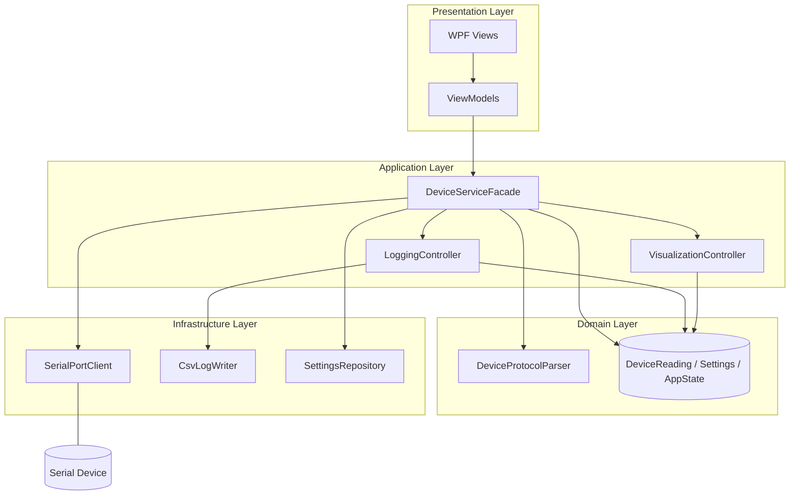
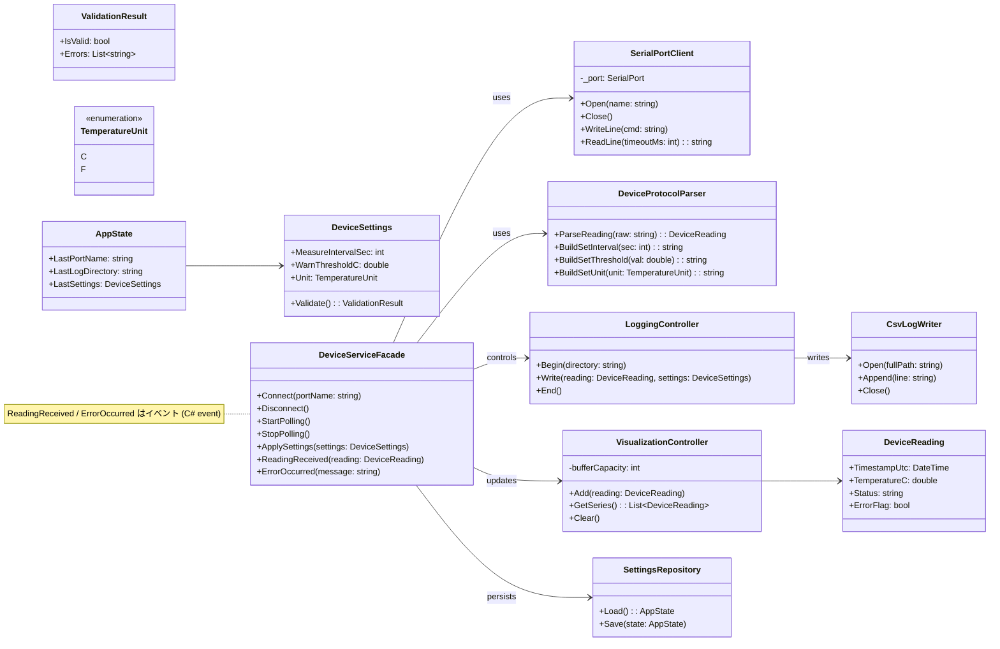
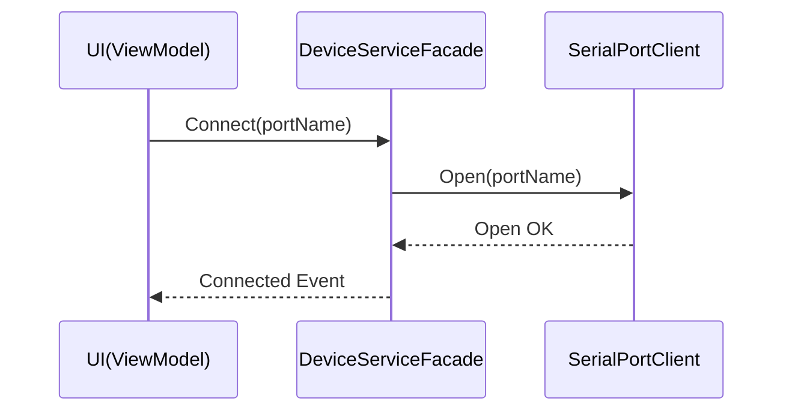
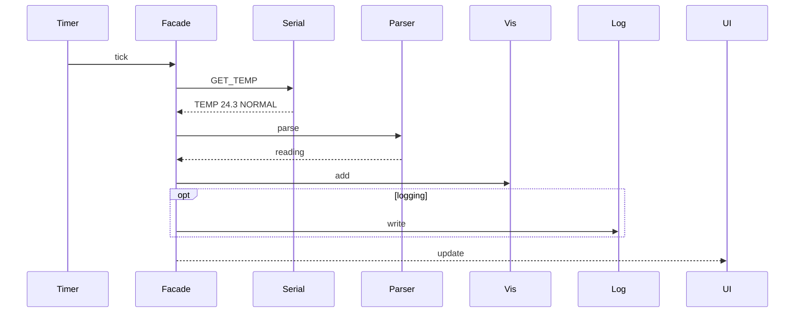
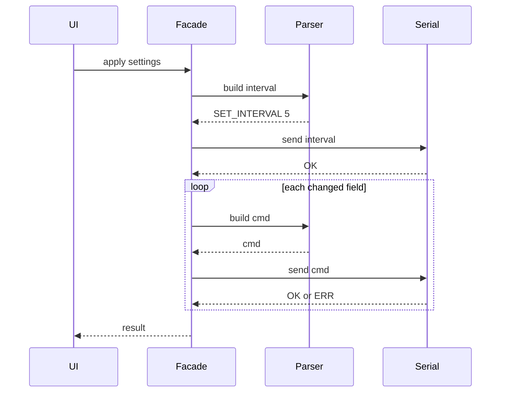
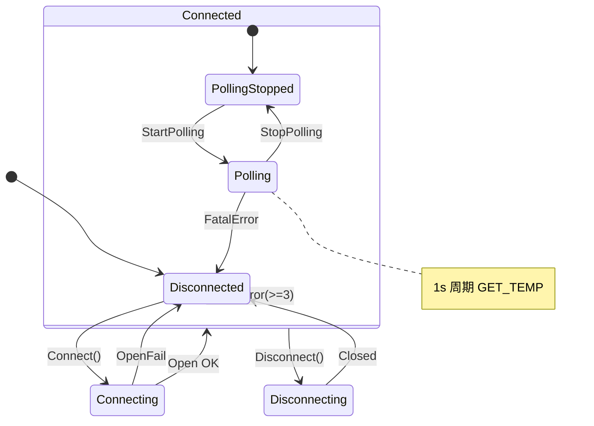
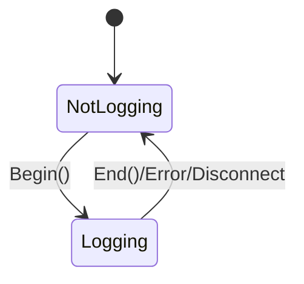

# DeviceLogManager ソフトウェア仕様書 (Full Mermaid Edition)

## 1. 文書メタ情報
| 項目 | 内容 |
|------|------|
| 文書名 | DeviceLogManager ソフトウェア仕様書 (Full Mermaid) |
| バージョン | 1.0.0 |
| 作成日 | 2025-10-02 |
| 対象システム | DeviceLogManager (WPF / .NET) |
| 元要件 | `youkenteigi.txt` (温度取得/ログ/可視化/設定変更) |
| 用途 | 実装計画・レビュー・テスト設計の基礎資料 |

## 2. 目的 / ゴール
温度センサー機器（シリアル接続）から 1 秒周期でデータを取得し、リアルタイム表示・CSV ログ保存・警告閾値/測定間隔/単位設定変更を GUI から操作可能にするシンプルで保守性の高いデスクトップアプリを提供する。

## 3. スコープ定義
| 種別 | 含む | 含まない (除外) |
|------|------|----------------|
| 機能 | シリアル接続, 取得, グラフ, CSV ログ, 設定送信 | 複数機器同時監視, ネット配信, 認証, 自動再接続(拡張) |
| 非機能 | 1秒周期性能, 単一責任設計, CSV 信頼性 | ハイアベイラビリティ, クラスタリング |

## 4. 用語
| 用語 | 説明 |
|------|------|
| ポーリング | 周期タイマーで `GET_TEMP` を送信し応答を解析する方式 |
| 閾値 (WarnThreshold) | WARN 状態へ移行を判定する温度境界 (内部 ℃) |
| 測定間隔 (MeasureInterval) | 機器内部で温度更新を行う周期 (1..60 秒) |
| 単位 | 表示単位 (C/F)・内部保持は常に ℃ |

## 5. 全体アーキテクチャ

### 5.1 レイヤ責務
| レイヤ | 目的 | 境界 / 注意点 |
|--------|------|---------------|
| Presentation | UI, バインド, コマンド | ロジックは ViewModel に集約 |
| Application | ユースケース調整 | イベント発火 / 例外集約 |
| Domain | ルール/変換/検証 | I/O 依存を排除 |
| Infrastructure | 外部資源アクセス | 例外→ドメイン例外変換 |

## 6. 機能一覧 (要件トレース)
| ID | 機能 | 要約 | 優先度 |
|----|------|------|--------|
| FR-001 | シリアル接続 | COMポート開閉 | High |
| FR-002 | 温度取得 | 1秒周期ポーリング | High |
| FR-003 | エラー表示 | 通信/解析/設定失敗通知 | High |
| FR-004 | CSV ログ | 自動追記保存 | High |
| FR-005 | ログ開始停止 | ユーザ制御 | Medium |
| FR-006 | グラフ表示 | 折れ線リアルタイム | Medium |
| FR-007 | グラフ ON/OFF | レンダ抑制 | Low |
| FR-008 | 設定変更 | 測定間隔/閾値/単位送信 | High |
| FR-009 | 測定間隔制約 | 1..60 | High |
| FR-010 | 閾値制約 | -50..100 | High |
| FR-011 | 単位変換 | C⇄F表示 | Medium |

## 7. 画面 UI (要約)
| 要素 | ID | 動作 | 備考 |
|------|----|------|------|
| COM ポート選択 | cboPort | ドロップダウン | 起動/更新列挙 |
| 接続トグル | tglConnect | 接続/切断 | 状態表示連動 |
| 最新温度 | txtCurrentTemp | Binding | 単位表示付与 |
| ステータス | txtStatus | NORMAL/WARN/ERROR | 色分け |
| ログ開始 | tglLogging | CSV オープン/クローズ | ファイル名固定化 |
| グラフ | chartTemp | 最新600点 | OFF時データ保持 |
| 測定間隔入力 | numInterval | 1..60 | バリデ前段階で制限 |
| 閾値入力 | numThreshold | -50..100 | 小数可 |
| 単位選択 | rdoC/rdoF | 切替即再表示 | 内部は℃保守 |
| 設定送信 | btnApply | 入力まとめ送信 | 部分失敗→ロールバック |

## 8. クラス構造詳細

## 9. シーケンス図
### 9.1 接続フロー

### 9.2 ポーリングサイクル

### 9.3 設定変更フロー

## 10. 状態機械

### 10.1 ログ状態

## 11. 通信仕様
| 項目 | 設定 |
|------|------|
| ボーレート | 9600 (変更拡張可) |
| DataBits | 8 |
| Parity | None |
| StopBits | 1 |
| Handshake | None |
| ReadTimeout | 1500ms |
| WriteTimeout | 1000ms |

### 11.1 コマンド/応答例
| コマンド | 目的 | 応答例 | エラー例 |
|----------|------|--------|----------|
| GET_TEMP | 温度取得 | TEMP=24.3;STATUS=NORMAL | (タイムアウト) |
| SET_INTERVAL=5 | 測定間隔設定 | OK | ERR:E01 |
| SET_THRESHOLD=25.5 | 警告閾値設定 | OK | ERR:E01 |
| SET_UNIT=F | 単位設定 | OK | ERR:E02 |

### 11.2 エラーコード
| コード | 意味 | UI | 再試行 |
|--------|------|----|--------|
| E01 | 範囲外 | ダイアログ | 入力修正 |
| E02 | 不明コマンド | ダイアログ | バージョン確認 |
| E99 | 内部異常 | 再試行案内 | 1 回可 |

## 12. パース仕様
| 項目 | 形式 | 正規表現案 | 備考 |
|------|------|------------|------|
| 読取応答 | TEMP=24.3;STATUS=NORMAL | `^TEMP=(-?\d+(?:\.\d+)?);STATUS=([A-Z_]+)$` | 負数許容 |
| OK | OK | `^OK$` |  | 
| ERR | ERR:E01 | `^ERR:([A-Z0-9]{3})$` | 3桁コード |

## 13. CSV 仕様
| 列 | 型 | 説明 |
|----|----|------|
| TimestampISO | string | UTC ISO8601 |
| TemperatureRaw | double | ℃ 生値 |
| TemperatureDisplay | double | 表示単位換算 |
| Unit | string | C/F |
| DeviceStatus | string | NORMAL/WARN/ERROR 等 |
| WarnThreshold | double | ℃ 基準 |
| MeasureInterval | int | 秒 |
| ErrorFlag | int | 0/1 |

ファイル名: `DeviceLog_yyyyMMdd_HHmmss.csv` (開始時確定)

## 14. バリデーション詳細
| 項目 | ルール | エラー表示 | ブロック |
|------|--------|------------|----------|
| MeasureInterval | Int 1..60 | 赤枠 + ToolTip | Yes |
| WarnThreshold | Double -50..100 | 同上 | Yes |
| Unit | C/F | デフォルト C | No |
| LogPath | 書込可能 | ダイアログ | Yes |

## 15. 単位変換
- C→F: F = C * 9/5 + 32
- F→C: C = (F - 32) * 5/9
内部保持は常に摂氏・グラフ再描画時に換算。

## 16. エラーハンドリング方針
| 状況 | 判定条件 | 処理 | 再試行ポリシ | 切断条件 |
|------|----------|------|--------------|-----------|
| タイムアウト | ReadLine Timeout | カウンタ加算 | 連続3回未満 | 3 回連続 |
| パース失敗 | 正規表現不一致 | ErrorFlag=1 | なし | カウンタ対象外 |
| Device ERR | ERR:コード | UI 通知 | 設定系のみ 1 回 | 失敗継続は手動 |
| ポート喪失 | IOException | 即時切断 | なし | 即時 |

## 17. 性能/リソース目標
| 指標 | 目標 | 計測方法 |
|------|------|----------|
| 1 サイクル処理時間 | <50ms 平均 | Stopwatch ログ | 
| メモリ増加 | 10 分で +10MB 以内 | PerfCounter | 
| GC Gen2 | 10 分間 0〜1 回 | GC コールバック | 

対策: 可変文字列削減 / 受信行は Span / リングバッファ固定長。

## 18. 内部ログ (アプリ) 
| レベル | 例 | 出力 |
|--------|----|------|
| Info | 接続/切断 | デバッグ出力 |
| Warn | 再送 | 同上 |
| Error | 連続タイムアウト | 同上 |
| Debug | 生受信文字列 | 開発ビルドのみ |

## 19. テスト観点マトリクス
| 観点 | ケース例 | 期待結果 |
|------|----------|----------|
| 接続 | 存在しないポート | エラー表示, 非接続維持 |
| ポーリング | 600 サイクル連続 | 欠測 0, タイマー遅延許容内 |
| 設定 | 間隔=0 送信阻止 | UI バリデで送信不可 |
| 閾値 | -51 入力 | 拒否 |
| 単位 | C→F 切替 | 直後表示変換正確 |
| CSV | ヘッダ行順 | 仕様一致 |
| エラー | 3 連続 Timeout | 自動切断イベント |
| 再起動 | 前回設定復元 | UI 初期値一致 |

## 20. トレーサビリティ (要件→章)
| 要件ID | 対応章 |
|--------|--------|
| FR-001 | 8,9.1,10 |
| FR-002 | 9.2,10 |
| FR-003 | 16 |
| FR-004 | 13,16 |
| FR-005 | 10.1 |
| FR-006 | 8,9.2 |
| FR-007 | 8,10 |
| FR-008 | 9.3,12 |
| FR-009 | 12 |
| FR-010 | 12 |
| FR-011 | 15 |
| NFR-001 | 17 |
| NFR-002 | 5,8 |

## 21. 拡張候補 (バックログ)
| ID | 案 | 期待価値 |
|----|----|---------|
| EXT-01 | 自動再接続 | 運用負荷低減 |
| EXT-02 | 警告ポップアップ/音 | 異常検知高速化 |
| EXT-03 | MQTT 送信 | 遠隔監視 |
| EXT-04 | 日次ローテ + Zip | 保存容量節約 |
| EXT-05 | 複数ポートタブ | 並列監視 |

## 22. リスクと緩和策
| リスク | 影響 | 緩和 |
|--------|------|------|
| シリアル不安定 | 欠測増加 | 連続失敗閾値+通知 |
| グラフ負荷 | UI カクつき | 点数固定 + 再サンプリング |
| CSV ロック | 追記失敗 | リトライ + 失敗ログ |
| 設定反映失敗 | 誤動作 | コマンド逐次検証/ロールバック |

## 23. 運用・保守
| 項目 | 方針 |
|------|------|
| 設定保存 | `%APPDATA%/DeviceLogManager/settings.json` |
| ログ初期パス | `%USERPROFILE%/Documents/DeviceLogs` |
| デプロイ | Self-contained .NET / MSI |
| バージョン | SemVer |

## 24. 変更履歴
| 版 | 日付 | 変更者 | 内容 |
|----|------|--------|------|
| 1.0.0 | 2025-10-02 | 自動生成 | 初版 |

---
以上。必要に応じてクラスインタフェース雛形/疑似コード追加可能。