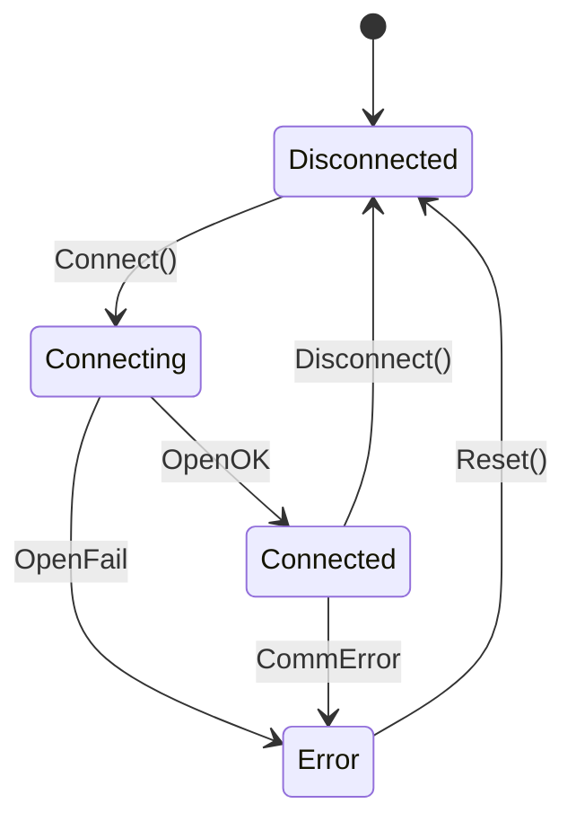
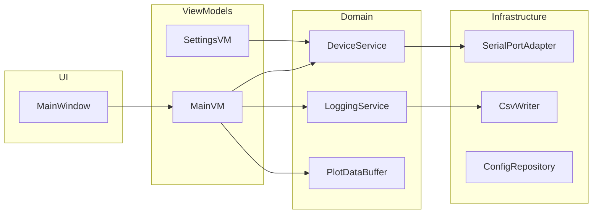
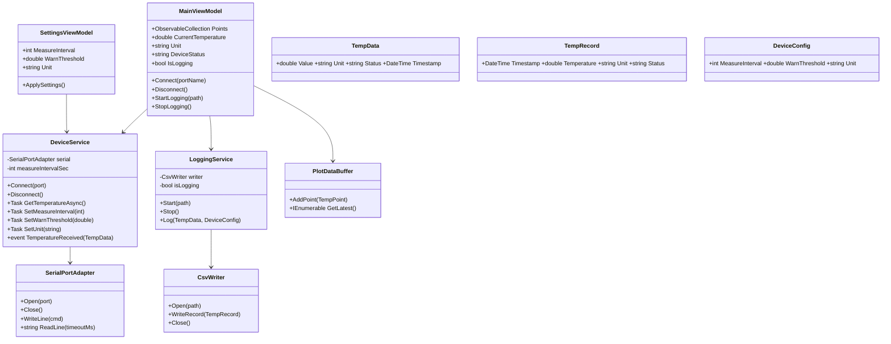
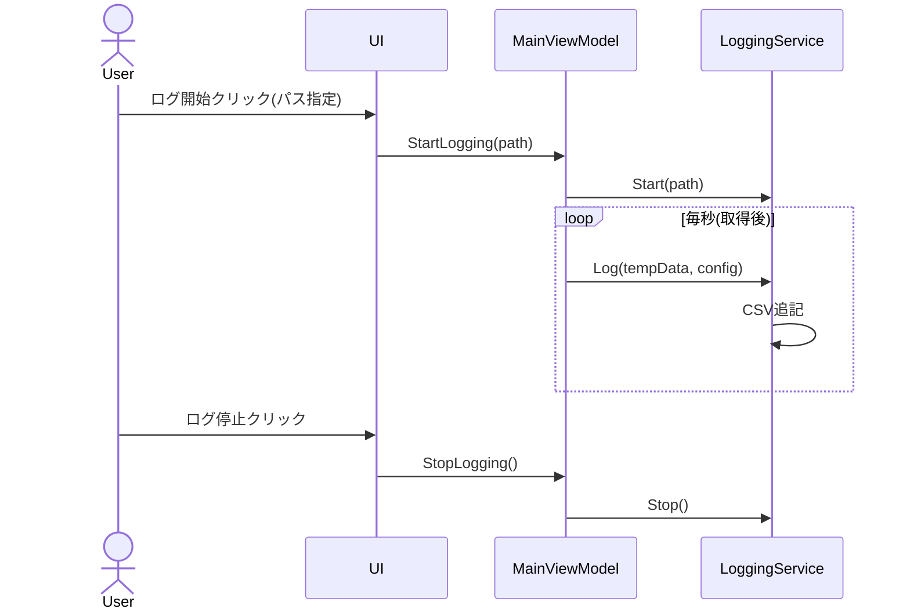
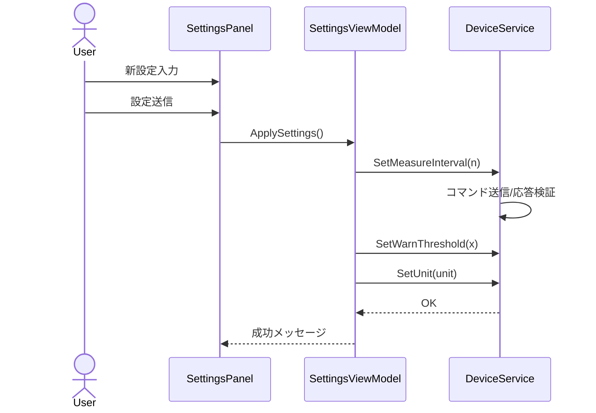

# DeviceLogManager ソフトウェア仕様書 (Mermaid版)

## 1. 概要
温度センサー機器とPCをシリアルポート (COM) で接続し、1秒毎に温度等データを取得・表示・CSV保存・リアルタイムグラフ描画・機器設定を書き換える Windows (WPF, C#) デスクトップアプリケーション。

## 2. 目的とゴール
- 利用者が機器の状態を視覚的に監視し、履歴を保存できる。
- 閾値や測定間隔等のパラメータをGUIで容易に変更できる。
- ログデータを分析しやすいCSV形式でエクスポート。

## 3. スコープ
| 区分 | 対象 | 非対象 |
|------|------|--------|
| OS | Windows 10 / 11 | macOS / Linux |
| 通信 | テキストベースシリアル | バイナリ独自プロトコル |
| グラフ | リアルタイム折れ線 | 過去大量データの統計処理 |
| 設定 | 単位/間隔/閾値 | 複数機器同時管理 |

## 4. 用語定義
- デバイス: 温度センサー機器
- ポーリング: 一定周期でコマンドを送信し結果取得
- ログセッション: ログ開始〜停止の一連の期間

## 5. ユースケース概要
1. ユーザはCOMポート選択→接続→温度が1秒毎に一覧/グラフに表示
2. ログ開始ボタン→CSVへ追記記録→停止ボタンで終了
3. 設定値入力→「設定送信」→機器へ書き込み→反映確認

## 6. 画面 (抽象)
- メインウィンドウ
  - 上部: 接続制御 (COM選択, 接続/切断ボタン, ステータス表示)
  - 中央左: 最新値表示 (温度, 単位, 閾値, 測定間隔, ステータス)
  - 中央右: リアルタイムグラフ (ON/OFF トグル)
  - 下部: ログ制御 (保存先パス, 開始/停止ボタン), 設定編集 (間隔, 閾値, 単位, 送信ボタン)
  - フッタ: メッセージ/エラー表示領域

## 7. 機能仕様詳細
### 7.1 接続 / 切断
- 入力: COMポート名, 接続ボタン
- 内部処理: `SerialPort` オープン, 初期ハンドシェイク (任意: `PING` → `OK`)
- 出力: 状態 = Connected | エラーダイアログ
- 失敗条件: ポート占有 / タイムアウト(既定3秒) / 速度不一致

### 7.2 データ取得 (ポーリング)
- 周期: 1000ms (Timer/DispatcherTimer)
- 送信: `GET_TEMP\n`
- 期待応答例: `TEMP=24.53;UNIT=C;STATUS=NORMAL` (フォーマット仕様化)
- パース: `TEMP=(double)`, `UNIT=(C|F)`, `STATUS=(NORMAL|WARN|ALARM|ERROR)`
- エラー時: リトライ最大3回→失敗で接続状態を Error に遷移しポーリング停止

### 7.3 ログ保存
- 条件: 接続済み + ログ開始フラグ ON
- CSV 追記: 1計測毎
- ヘッダ: `Timestamp,Temperature,Unit,WarnThreshold,MeasureInterval,DeviceStatus,ErrorCode`
- 文字コード: UTF-8 (BOM付) 既定
- ファイルローテーション: 初期版は無し (開始時に新規 or 既存末尾追記) / 拡張余地有

### 7.4 リアルタイムグラフ
- データ保持最大点数: 300 (約5分) → 超過時はFIFOで古い点を削除
- OFF時: 取得は継続 / バインド更新停止 (描画コスト削減)
- ライブラリ: WPF標準 + Polyline / or OxyPlot (検討) → 初期版: Polyline

### 7.5 設定変更
- GUI入力検証:
  - 測定間隔 1〜60 (整数)
  - 警告閾値 -50.0〜100.0 (double)
  - 単位 C|F
- 送信コマンド例:
  - `SET_MEASURE_INTERVAL=5\n`
  - `SET_WARN_THRESHOLD=25.5\n`
  - `SET_UNIT=C\n`
- 成功確認: 応答 `OK` / 失敗 `ERR:CODE`

### 7.6 エラーハンドリング
| 種別 | 例 | 対応 |
|------|----|------|
| 通信タイムアウト | 応答無 | リトライ→失敗時切断 |
| パース失敗 | `TEMP=??` | 行破棄 + Warning表示 |
| ファイルIO | 書き込み不可 | ログ停止 + ダイアログ |
| 設定送信失敗 | `ERR:VAL` | メッセージ + 再入力誘導 |

## 8. 状態モデル
- ConnectionState: Disconnected / Connecting / Connected / Error
- LoggingState: Idle / Logging
- DeviceStatus: NORMAL / WARN / ALARM / ERROR



## 9. アーキテクチャ概要
- パターン: MVVM
- 層: UI(WPF Views) / ViewModel / Domain(Service, Model) / Infrastructure(Serial, File)



## 10. クラス図


## 11. シーケンス図
### 11.1 接続と周期取得
```mermaid
sequenceDiagram
    actor User
    participant UI as MainWindow
    participant VM as MainViewModel
    participant DS as DeviceService
    participant SP as SerialPortAdapter
    User->>UI: ポート選択/接続クリック
    UI->>VM: Connect(port)
    VM->>DS: Connect(port)
    DS->>SP: Open(port)
    SP-->>DS: OpenOK
    activate VM
    loop 毎秒
        VM->>DS: GetTemperatureAsync()
        DS->>SP: WriteLine(GET_TEMP)
        DS->>SP: ReadLine()
        SP-->>DS: TEMP=24.53;UNIT=C;STATUS=NORMAL
        DS-->>VM: TempData
        VM->>VM: 状態更新/Points追加
    end
    deactivate VM
```

### 11.2 ログ開始/停止


### 11.3 設定変更


## 12. データモデル詳細
| 名称 | 項目 | 型 | 説明 |
|------|------|----|------|
| TempData | Timestamp | DateTime | 取得時刻 |
| TempData | Value | double | 温度値 |
| TempData | Unit | string | C or F |
| TempData | Status | string | NORMAL/WARN/ALARM/ERROR |
| DeviceConfig | MeasureInterval | int | 秒 |
| DeviceConfig | WarnThreshold | double | 閾値 |
| DeviceConfig | Unit | string | C/F |

## 13. CSVフォーマット
例:
```
Timestamp,Temperature,Unit,WarnThreshold,MeasureInterval,DeviceStatus,ErrorCode
2025-10-02T12:00:00.123Z,24.53,C,30.0,5,NORMAL,
```

## 14. 例外 / エラーメッセージ指針
| コード | 表示メッセージ(例) | 対処アクション |
|--------|--------------------|----------------|
| E_PORT_OPEN | ポートを開けません | ポート選択再試行 |
| E_TIMEOUT | 応答がありません | 再接続推奨 |
| E_PARSE | データ形式不正 | 取得処理継続 | 
| E_FILE_IO | ログを書き込めません | 保存先確認 |

## 15. 設定保持
- アプリユーザ設定 (ローカル JSON): 最終使用ポート, 最終ログ保存パス, グラフON/OFF デフォルト
- ファイル例: `appsettings.json`
```
{
  "LastPort": "COM3",
  "LastLogDir": "C:/logs",
  "DefaultGraphEnabled": true
}
```

## 16. 非機能要件対応
| 要件 | 対応設計 |
|------|----------|
| 1秒描画遅延無し | Points上限300 & UIスレッド最小処理 |
| 保守性 | MVVM + 単一責任クラス分割 |
| 拡張性 | DeviceServiceインターフェース化で別デバイス差替え |

## 17. テスト観点 (抜粋)
- 接続: 正常 / ポート占有 / 存在しないポート
- ポーリング: 連続300回遅延 < 5% 逸脱
- ログ: 開始→1秒後ファイル行数>=2 / 停止後追記されない
- 設定: 境界値(1,60,-50,100) / 不正値(0,61,文字列)
- エラー: パース不能行があってもアプリ継続

## 18. リスクと今後拡張
| リスク | 緩和策 |
|--------|--------|
| シリアルノイズ | CRC付与検討 / 再送規約 | 
| ファイル肥大 | ローテーション機能追加 | 
| UIフリーズ | 非同期 + Dispatcher最小化 | 

## 19. 変更履歴
| 版 | 日付 | 内容 |
|----|------|------|
| 0.1 | 2025-10-02 | 初版 (Mermaid仕様書) |

---
© 2025 DeviceLogManager Project
